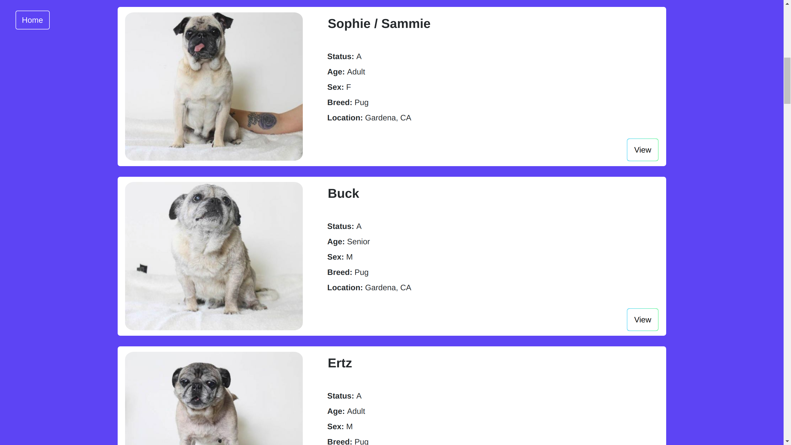

# breed-obsession-react
This project is a re-write of a previous project built using Angular 5.

Breed Obsession is a Web Application that allows you to search for adoptable pets by animal, breed, and location. 

This version is built using React 16, Redux, Node/Express, Webpack, and the PetFinder API

